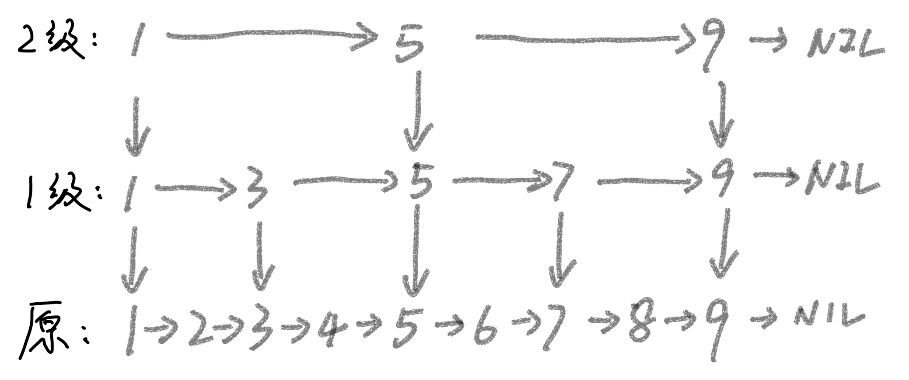
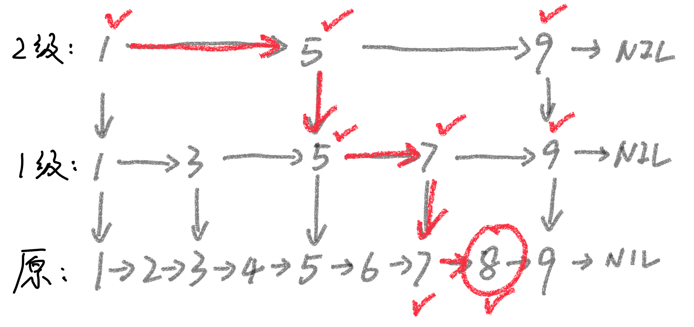
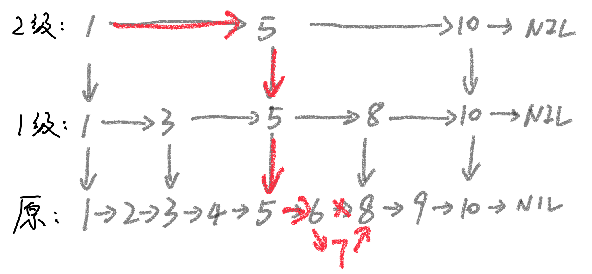
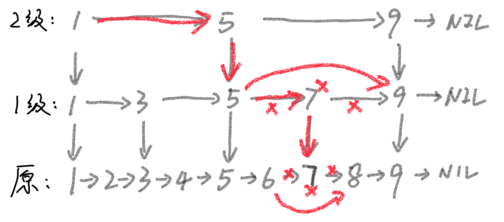
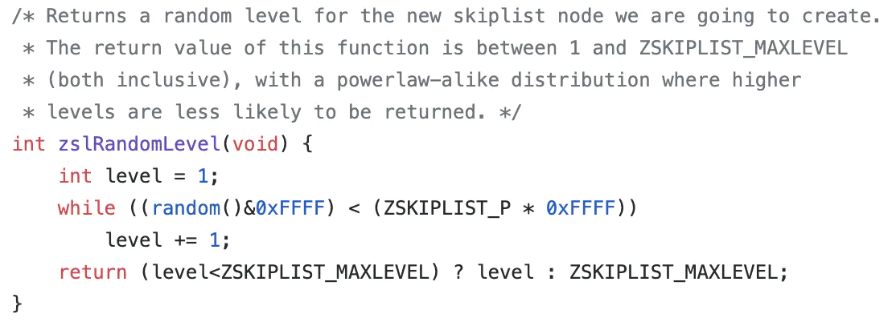

# 跳表大总结

> 
> 💡 本期精彩内容：
> 
> 🤔 你为什么需要了解跳表，它**解决了什么问题**
> 
> 👩🏻‍💻 跳表的**增删改查**如何实现
> 
> 👑 **面试**中如何回答跳表问题，才能让你出众

# Why it Happens

- 链表查询太慢 → **O(n)**
- 什么算法查询快？二分！→ **O(logn)**
- 怎么把二分思想在链表中实践？→ 跳表的诞生 → **O(?)**

# How it Works

## 二分查找

- 有序
- 数组元素可以随机访问 → 寻址 O(1)

## 改造链表

- 有序，不在改造范围内
- 加快寻址速度
    - **空间换时间** → 上索引
    - 构建索引层 → 每 2 个节点提取 1 个到上一级，逐层构建

## 💥 BOOM!

- 时间复杂度
    - **跳表高度**：n, n/2, n/4, n/8, …, n/(2^k)  → log2n
    - 每层遍历 m 个节点 → O(m*logn)
    - 每层索引最多只需要遍历 3 个节点 → **O(logn)**
- 空间复杂度
    - n/2 + n/4 + n/8 + … + 8 + 4 + 2 → n-2 → **O(n)**
    - 实际操作中，链表中存储的对象元素很大，索引节点只会存关键信息（比如 id）和**指针**，索引占用的额外空间可以忽略不计

## 增删改查

### 改查

- 先找到节点，再更新节点内容 → **等同于查找**的复杂度 → **O(logn)**
- 索引节点存关键信息，大概率不需要更新索引层，取决于索引节点存什么

### 插入

- 为确保**有序**，先找到节点该在的位置 → **O(logn)**
- 链表的插入操作是 O(1) → 总复杂度 **O(logn)**
- **问题**：**索引层怎么更新？**如果不更新，跳表就会退化成链表，但重建似乎本末倒置

### 删除

- 单链表：先查找到待删除的节点，需要保存删除节点的前驱节点，再做删除 → O(logn)
- 双向链表：不用保存前驱节点，找到待删除节点后，改指针内容即可 → O(logn)
- **问题**：待删除的节点出现在索引层中，怎么办？→ 在查询的过程中，删索引中的节点

# 知识扩展：索引的更新

## 目的：讲究一个配合

- 插入：索引层哪些位置要插入这个节点？

## 实现：大道至简，随机 + 概率

### 随机建立索引

- 原链表，随机抽 n/2 个元素建立一级索引
- 一级索引，随机抽 n/4 个元素建立二级索引
- 以此类推，元素越多，索引分布越均匀

### 概率更新索引

- 设计一个特别的函数，**按照概率**返回 [1, MAX_LEVEL] 之间的整数
- 1/2 的概率返回 1，不需要更新索引，直接在在原链表中插入元素
- 1/4 的概率返回 2，需要为新元素建立一级索引
- 以此类推，无论插入多少个元素，各级索引的节点数依然是 n/2, n/4, ….

> Redis 源码
> 

# 👀 面试怎么聊

## 面试问题

- 是否了解跳表？
- Redis 为什么用跳表？
- Redis 为什么用跳表？为什么不用红黑树？
- 实现跳表（变态！）

## 必答点

- **二分思想在链表的应用**，提升查找效率，**O(n) → O(logn)**
- **空间换时间**，构建索引层，空间复杂度 O(n)
- 增删改查都很高效 -> O(logn)

## 加分点

- 索引层的更新，看过 Redis 跳表的源码，一些侃侃而谈
- 跳表和红黑树的对比
    - 共同点
        - 高效查找、动态插入删除，都能做到 O(logn)
    - 区别
        - 跳表能按照指定的区间查数据
        - 红黑树实现起来很复杂，跳表实现起来不容易出错（不给自己挖坑）

## 延伸点

- 对比红黑树
- 对比散列表
- Redis 的其他特性，除了跳表，我还知道 xxxx