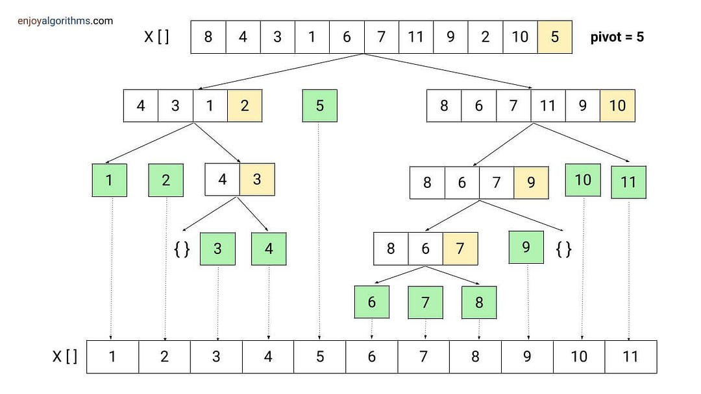
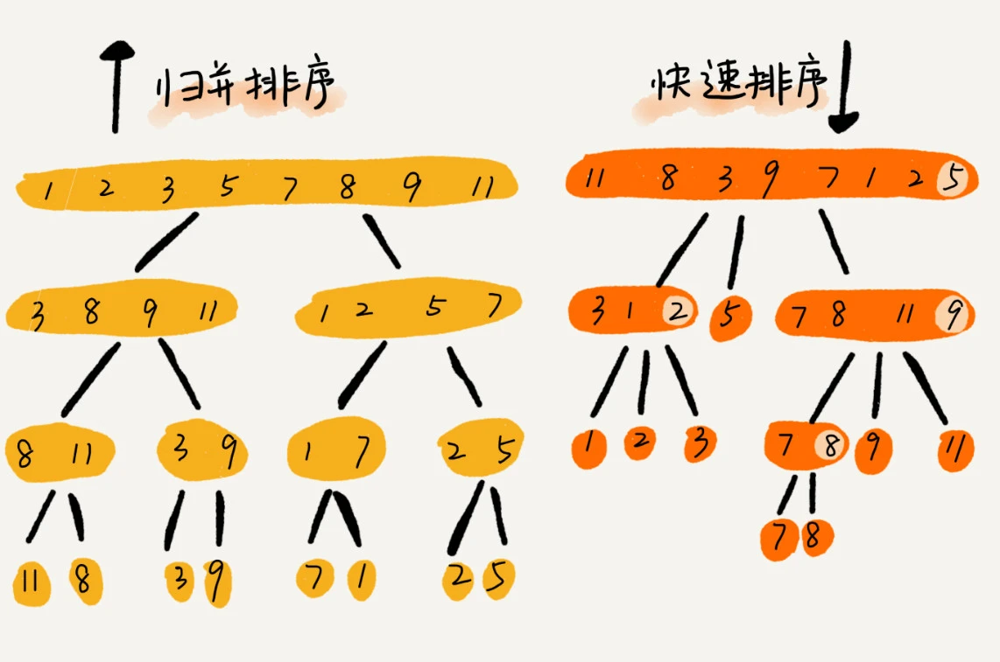
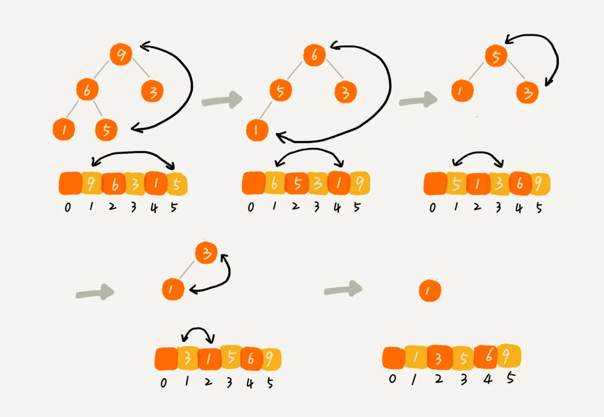

# 排序算法哪家强

> 
> 💡 本期精彩内容：
> 
> - 归并、快排、堆排序的代码实现和性能分析
> - 到底哪个算法更快？为什么？

# 归并


## 代码实现

> 先分解为子问题，子数组排好序后，再合并为大数组。
> 

```go
func mergeSort(nums []int, l, r int) {
	if l >= r {
		return
	}
	// 先分解
	mid := l + (r-l)/2
	mergeSort(nums, l, mid)
	mergeSort(nums, mid+1, r)
	// 再合并（排序）
	merge(nums, l, mid, r)
}

func merge(nums []int, l, m, r int) {
	temp := make([]int, 0)
	i, j := l, m+1
	for i <= m && j <= r {
		if nums[i] < nums[j] {
			temp = append(temp, nums[i])
			i++
		} else {
			temp = append(temp, nums[j])
			j++
		}
	}
	if i <= m {
		temp = append(temp, nums[i:m+1]...)
	}
	if j <= r {
		temp = append(temp, nums[j:r+1]...)
	}
	for k := l; k <= r; k++ {
		nums[k] = temp[k-l]
	}
}
```

## 性能分析

- 时间复杂度：O(n*logn)
    - n 个元素 divide 是 O(logn)，merge n次是 O(n*logn)
- 空间复杂度：O(n)
    - 需要额外空间，**非原地操作**

# 快排



## 代码实现

> 先分区，每次比完大小 pivot 都找到了该在的位置，再递归解决子问题。
> 

```go
func quickSort(nums []int, l, r int) {
	if l >= r {
		return
	}
	// 先分区
	p := partition(nums, l, r)
	// 再递归
	quickSort(nums, l, p-1)
	quickSort(nums, p+1, r)
}

func partition(nums []int, l, r int) int {
	pivot := nums[r]
	i, j := l, l
	for j < r {
		if nums[j] < pivot {
			nums[i], nums[j] = nums[j], nums[i]
			i++
		}
		j++
	}
	nums[i], nums[r] = nums[r], nums[i]
	return i
}
```

## 性能分析

- 时间复杂度：O(n*logn)
    - n 个元素 divide 是 O(logn)，partition n次是 O(n*logn)
- 空间复杂度
    - 无需额外空间，**原地操作**

# 归并 VS 快排



- 归并：自下而上处理，分治 + 合并
- 快排：自上而下处理，分区 + 分治

# 堆排序



## 代码实现

```go
func heapSort(nums []int) {
	buildHeap(nums)
	for i := len(nums) - 1; i >= 0; {
		swap(nums, 0, i)
		i--
		siftDown(nums, 0, i)
	}
}

func buildHeap(array []int) {
	// sift down heapify
	lastNonLeafIndex := (len(array) - 2) / 2
	for i := lastNonLeafIndex; i >= 0; i-- {
		siftDown(array, i, len(array)-1)
	}
}

// 大顶堆
func siftDown(array []int, index, lastIndex int) {
	leftIndex := index*2 + 1
	rightIndex := index*2 + 2
	swapIndex := index
	// 比较
	if leftIndex <= lastIndex && array[leftIndex] > array[swapIndex] {
		swapIndex = leftIndex
	}
	if rightIndex <= lastIndex && array[rightIndex] > array[swapIndex] {
		swapIndex = rightIndex
	}
	// 交换
	if swapIndex != index {
		swap(array,
			swapIndex, index)
		siftDown(array, swapIndex, lastIndex)
	}
}

func swap(array []int, i, j int) {
	array[i], array[j] = array[j], array[i]
}
```

## 性能分析

- 时间复杂度：O(n*logn)
    - 建堆：O(n)
    - 堆化：O(n*logn)
- 空间复杂度
    - 无需额外空间，**原地操作**

# 堆排序 VS 快排

- 排序的核心是**比较和交换**
- 堆排序的交换次数大于快排，快排优于堆排序