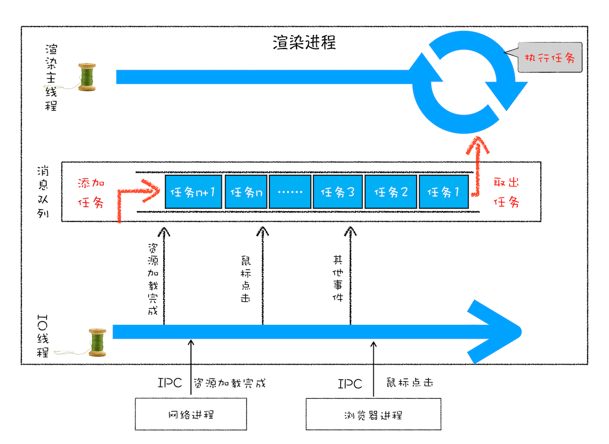
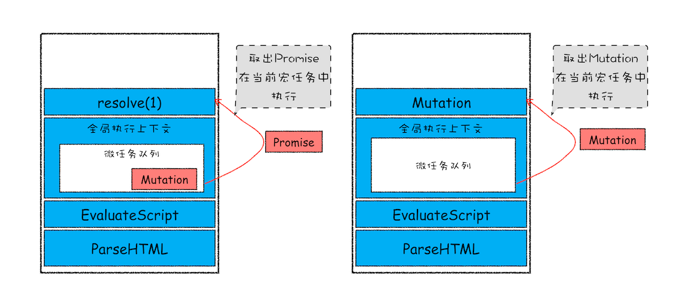

# 事件循环机制

每个渲染进程有一个主线程，要处理解析 DOM、计算样式、处理布局、处理 JS 任务以及用户输入事件，这就需要一个系统来调度这些任务。

## 单线程阶段

### 单线程处理安排好的任务

当代码按照顺序写在主线程里，任务会被按顺序执行。


### 线程运行过程中处理新任务

引入循环机制，例如 for 语句监听是否有新任务，线程会一循环执行。

引入事件，阻塞 IO，当线程运行中等待用户输入，这时线程处于暂停状态，当输入完成后，线程会被激活继续余下操作。


### 处理其他线程发来的任务

主线程会频繁接收其他线程的任务，接收到任务后需要处理。这些待执行任务怎么存储，才能保证良好地接收呢？

使用消息队列这种数据结构存放任务，遵循先进先出的原则。


### 处理其他进程发来的任务

渲染进程中的 IO 线程负责接收其他进程发来的消息，之后会变成处理其他线程发来的任务流程。



### 应用

#### setTimeout

通常情况下，渲染进程会把需要运行在主线程上的任务依次添加到消息队列，事件循环系统再按照顺序执行队列中的任务。

定时器设置的回调函数，是在指定时间间隔内调用，就不能按照顺序执行，所以不能把定时器中的回调函数直接添加到消息队列。

Chrome 为此另外维护了需要延迟执行的任务列表，所以 setTimeout 的回调任务就被添加到延迟队列中。

事件循环的函数中在何时执行延迟列表中的任务呢？维护一个 ProcessDelayTask 函数专门用来执行延迟队列中的任务，在处理完消息队列中的一个任务后，就执行该函数。这个函数根据发起时间和延迟时间，计算出到期的任务，然后依次执行这些到期任务。等到期任务执行完成后，再继续下一个循环过程。

##### 注意事项

1. 主线程当前任务执行时间过久，会影响定时器任务的执行。例如，设置 1ms 延时的回调任务，设置好后主线程会继续执行消息队列的下个任务，需要等待当前的任务执行完成，如果是个 5000 次的 for 循环，用时超过 1ms，那么作为下个任务的回调就会被延迟执行。
2. setTimeout 嵌套使用时，系统会设置最短时间间隔为 4ms。
3. 在未激活的页面上，setTimeout 的执行最小间隔是 1000ms。
4. 延时执行的时间有最大值，大约是 24.8 天。

#### XMLHttpRequest

##### 回调函数

###### 同步回调

bar 函数作为参数传递给 foo 函数，在 foo 执行结束之前执行 bar，这个过程就是同步回调。同步回调是在当前主函数的执行上下文中执行回调函数。

###### 异步回调

bar 函数作为参数传递到 foo 函数，使用 setTimeout 让 bar 在 foo 执行结束后，延时执行，bar 并不是在 foo 内部被调用，在主函数外部执行的过程就是异步回调。浏览器的处理方式有两种：

- 把异步函数当作一个任务，添加到消息队列尾部
- 把异步函数添加到微任务队列中，在当前任务的末尾处执行微任务

##### XMLHttpRequest 的运行机制

```js
function GetWebData(URL) {
  /**
   * 1:新建XMLHttpRequest请求对象
   */
  let xhr = new XMLHttpRequest();

  /**
   * 2:注册相关事件回调处理函数
   * 网络请求耗时，需要注册回调函数，在后台任务执行完成后，通过调用回调函数查看执行结果
   */
  xhr.onreadystatechange = function () {
    switch (xhr.readyState) {
      case 0: //请求未初始化
        console.log("请求未初始化");
        break;
      case 1: //OPENED
        console.log("OPENED");
        break;
      case 2: //HEADERS_RECEIVED
        console.log("HEADERS_RECEIVED");
        break;
      case 3: //LOADING
        console.log("LOADING");
        break;
      case 4: //DONE
        if (this.status == 200 || this.status == 304) {
          console.log(this.responseText);
        }
        console.log("DONE");
        break;
    }
  };
  xhr.ontimeout = function (e) {
    console.log("ontimeout");
  };
  xhr.onerror = function (e) {
    console.log("onerror");
  };

  /**
   * 3:打开请求
   */
  xhr.open("Get", URL, true); //创建一个Get请求,采用异步

  /**
   * 4:配置参数
   */
  xhr.timeout = 3000; //设置xhr请求的超时时间
  xhr.responseType = "text"; //设置响应返回的数据格式
  xhr.setRequestHeader("X_TEST", "time.geekbang");

  /**
   * 5:发送请求
   */
  xhr.send();
}
```


- 渲染进程把请求发送给网络进程，网络进程负责下载资源，这时渲染进程继续执行其消息队列中的任务。
- 网络进程接收到数据后，通知渲染进程。
- 渲染进程将 xhr 回调函数封装成任务添加到消息队列中。
- 主线程循环系统执行到回调任务时，根据相关状态，调用对应的回调函数。

##### 安全问题

1. 跨域问题。根据同源策略，XMLHttpRequest 是不能进行跨域请求的。
2. HTTPS 混合内容问题。HTTPS 的页面包含了不符合其安全要求的内容时，浏览器会给出警告。使用 XMLHttpRequest 请求时，浏览器会认为是攻击者发起的，阻止请求发起。

### 存在的问题

1. **任务没有优先级**。例如，监听 DOM 节点变化时，DOM 变化频繁，需要经常调用 JS 接口，任务执行时间会很长，如果采用异步，就会影响监控的实时性。后来，使用**宏任务**和**微任务**解决了这个问题。
2. 单个任务执行时间过长怎么办。JS 任务长时间占据主线程，会造成页面卡顿。解决方法是，让要执行的 JS 任务滞后执行，通过回调功能实现需求。

## 宏任务与微任务

### 宏任务

渲染进程维护多个消息队列，有延迟执行队列和普通的消息队列，主线程的事件循环机制，采用 for 循环，不断地从消息队列中取出任务执行。这些任务就叫做宏任务。包括：

- 渲染事件，解析 DOM、计算布局、绘制
- 用户交互事件，鼠标点击、滚动页面、放大缩小
- JS 脚本执行事件
- 网络请求完成、文件读写完成事件

当使用 setTimeout 设置回调任务间隙时，消息队列中有其他系统级任务，因为回调函数是宏任务，在执行回调函数前，当前任务执行时间过长，会导致执行间隔无法精确控制，比如监听 DOM 的变化。

### 微任务

异步函数两种调用方式：

- 回调函数封装成宏任务，添加到消息队列中，循环系统执行到该任务时执行回调函数。例如，setTimeout 和 XMLHttpRequest 中的回调函数。
- 用微任务的方式，在主函数执行结束后、当前宏任务结束前执行回调函数。

所以说，**微任务是一个需要异步执行的函数，执行时机是在主函数执行结束之后，当前宏任务执行结束之前执行。**

在 V8 中，执行 JS 前，创建全局执行上下文，同时会创建**微任务列表**，当前宏任务执行时产生的微任务会保存在微任务队列中。

> 微任务如何产生？

1. 使用 MutationObserver 监控 DOM 节点，使用 JS 对其操作，DOM 节点发生变化时，会产生 DOM 变化记录的微任务。
2. 使用 Promise，调用`Promise.resolve()`和`Promise.reject()`会产生微任务。

> 微任务队列何时被执行？

在当前宏任务的 JS 快执行完成时，V8 准备退出全局执行上下文并清空调用栈，此时 V8 会检查全局上下文中的微任务队列，按顺序执行队列中的微任务。

如果执行微任务的过程中，产生了新的微任务，则会将微任务继续添加到微任务队列中，V8 一直循环执行队列中的任务，直到队列清空。




- 微任务和宏任务是绑定的，宏任务执行时，会创建自己的微任务队列
- 微任务的执行时长会导致当前宏任务时长变久
- 在一个宏任务中，分别创建一个用于回调的宏任务和微任务，无论什么情况下，微任务都比宏任务早执行

#### Promise

```js
console.log(1);
setTimeout(function () {
  //settimeout1
  console.log(2);
}, 0);
const intervalId = setInterval(function () {
  //setinterval1
  console.log(3);
}, 0);
setTimeout(function () {
  //settimeout2
  console.log(10);
  new Promise(function (resolve) {
    //promise1
    console.log(11);
    resolve();
  })
    .then(function () {
      console.log(12);
    })
    .then(function () {
      console.log(13);
      clearInterval(intervalId);
    });
}, 0);

//promise2
Promise.resolve()
  .then(function () {
    console.log(7);
  })
  .then(function () {
    console.log(8);
  });
console.log(9);
```

上述打印结果为：`1 9 7 8 2 3 10 11 12 13`

#### MutationObserver

Web 需要监视 DOM 变化并及时做出响应。

- 早期没有监听，只能用轮询检测的方式检测 DOM 是否变化。
- 引入观察者模式，DOM 变动会立刻触发事件，同步回调，但是频繁变动会造成频繁调用 JS，性能开销大。
- 异步调用，等多次 DOM 变化后，一次触发异步调用，用一个数据结构记录所有的 DOM 变化。利用异步+微任务结合的策略，解决性能问题和实时性问题。
