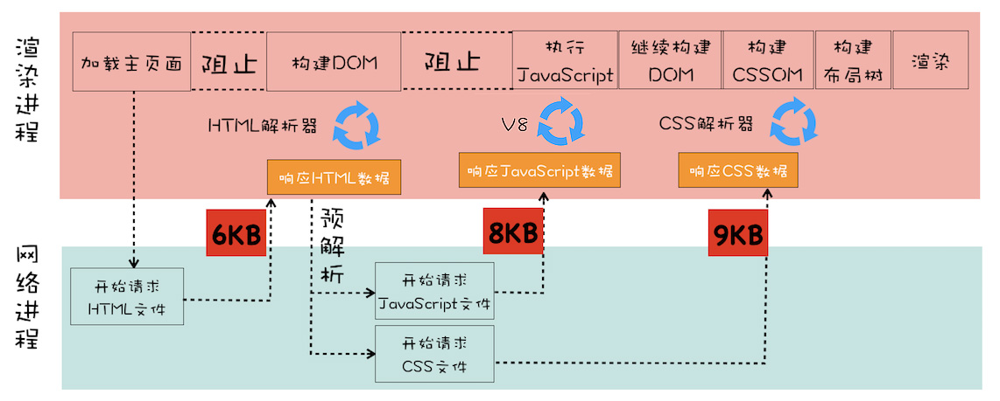

# 页面渲染流程

## 大致流程


1. 构建 DOM 树。(DOM)
2. CSS 样式表转为 styleSheets，计算出 DOM 节点的样式，生成 CSSOM 对象。(Style)
3. 构建布局树，去掉不显示的 DOM 节点，计算布局信息。(Layout)
4. 分层布局树，生成分层树，一个页面是由多个图层叠加合成的。(Layer)
5. 为每个图层生成绘制列表，提交(commit)给合成线程。
6. 合成线程把图层分成图块(tile)，在光栅化线程池中将图块转换成位图。栅格化(raster)过程可以使用 GPU 加速，生成的位图保存在 GPU 内存中。
7. 光栅化所有图块后，合成线程发出绘制图块(draw quad)的命令。
8. 浏览器进程根据接收到的命令生成页面，显示在屏幕上。(display)

## DOM 的构建

渲染引擎内部的 HTML 解析器负责把 HTML 字节流转换为 DOM 结构。解析器并不是等整个文档加载完再解析，而是加载多少数据，就解析多少数据。

### 字节流转为 Token

Token 分为 Tag Token 和文本 Token，分词器通过词法分析可以生成 Token。


### 解析 Token

HTML 解析器维护 Token 栈结构，根据栈计算节点的父子关系，分词器产生的新 Token 不断压栈出栈。HTML 解析器在开始工作时，会默认创建一个根为 document 的空 DOM 结构，解析 Token 的过程中，同时创建新的 DOM 节点，将其加入 DOM 树中。

### JS 如何影响 DOM 的构建

#### 内嵌脚本

```html
<html>
  <body>
    <div>1</div>
    <script>
      let div1 = document.getElementsByTagName('div')[0] div1.innerText = 'abc'
    </script>
    <div>test</div>
  </body>
</html>
```

在解析 DOM 的过程中，遇到了 script 脚本标签，HTML 解析器会暂停工作，JS 引擎介入，执行这段脚本。因为这段脚本修改了第一个 div 节点的内容，在脚本执行完成后，节点内容已被修改。HTML 解析器恢复解析过程，继续解析后续内容，直到最终的 DOM 生成。

#### 引入外部文件

```html
<html>
  <body>
    <div>1</div>
    <script type="text/javascript" src="foo.js"></script>
    <div>test</div>
  </body>
</html>
```

同样，先暂停 DOM 解析，执行 script 脚本代码，这里需要先下载代码，**下载过程会阻塞 DOM 的解析**，而且会受到网络环境和 JS 文件大小因素的影响。

Chrome 对此做了预解析操作的优化，在渲染引擎收到字节流后，开启预解析线程，分析 HTML 文件中依赖的外部文件，并提前下载这些文件。

因为 JS 线程会阻塞 DOM 的解析，可以通过 CDN 加速 JS 文件加载，webpack 打包压缩文件体积。如果 JS 文件没有操作 DOM 的代码，可以将脚本设置为异步加载，用 async 或 defer 来标记。

- async 是脚本文件一旦加载完成，就会立即执行，所以可能会阻塞页面渲染。
- defer 是脚本文件在 DOMContentLoaded 事件前执行，也就是 HTML 解析完成后执行，不会阻塞页面渲染。

```html
<script async type="text/javascript" src="foo.js"></script>
<script defer type="text/javascript" src="foo.js"></script>
```

#### JS 操纵 CSSOM

```html
<html>
  <head>
    <style>
      div {
        color: blue;
      }
    </style>
  </head>
  <body>
    <div>1</div>
    <script>
      let div1 = document.getElementsByTagName("div")[0];
      div1.innerText = "time"; //需要DOM
      div1.style.color = "red"; //需要CSSOM
    </script>
    <div>test</div>
  </body>
</html>
```

在执行 JS 前，构建 DOM 的时候也在并行构建 CSSOM。如果引用了外部 CSS 文件，会在执行 JS 前下载 CSS 文件，解析生成 CSSOM 对象后，再执行 JS。所以，CSS 文件会阻塞 JS，JS 阻塞 DOM 的生成，CSS 间接地阻塞了 DOM 的生成。

## CSSOM 的构建

渲染引擎无法直接理解 CSS 文件内容，需要解析成 CSSOM 对象，在 DOM 中可以通过`document.styleSheets`查看。CSSOM 的作用在于：

- 给 JS 操作样式表的能力
- 为布局树的合成提供样式信息

在含有 JS 和 CSS 文件的页面渲染时，预解析过程中下载外部文件，同时发起 JS 和 CSS 文件的下载请求，下载时间由最久的文件来算。在 CSS 文件下载完成后生成 CSSOM，再执行 JS，这个过程会阻塞 DOM 的构建，在 JS 执行完成后，才会继续构建 DOM。


## 如何优化页面首次展示的白屏时间

从 URL 请求发起开始，到首次显示页面的内容，视觉上经历三个阶段：

1. 网络请求 HTML 数据。
2. 接收到数据后，渲染进程创建空白页面，即**解析白屏**，在 CSS、JS 文件加载完成生成 CSSOM 和 DOM，继续合成布局树。
3. 首次渲染完成，绘制页面，生成完整页面。

第二阶段的影响因素有：HTML 解析，CSS、JS 文件下载，生成 CSSOM，执行 JS，生成布局树。可以缩短白屏时间的策略有：

- 使用内联 JS 和内联 CSS 移除下载过程。
- 减小文件大小，使用 webpack 压缩文件。
- 不需要在解析阶段使用的 JS 文件，标记 async 或 defer。
- 大的 CSS 文件，拆分成多个不同用途的文件，使用 media 媒体查询属性，在指定场景下加载特定 CSS 文件。

## 如何系统优化页面速度

### 加载阶段

> 从发出请求到渲染出完整页面，影响因素有网络和 JS 脚本



1. 减少资源的个数
2. 降低资源的大小
3. 降低请求资源需要的 RTT 次数，例如使用 CDN

### 交互阶段

> 加载完成到用户交互的整合过程，影响因素主要是 JS 脚本


JS 触发交互，生的一个新的帧是由 JS 通过 DOM 或 CSSOM 触发的。

1. 减少 JS 执行时间，分解任务。
2. DOM 读写分开，在修改 DOM 后立即查询，会触发强制同步布局。
3. 利用 CSS 合成动画。
4. 避免频繁的垃圾回收，垃圾回收会占用主线程。

#### 重排

通过 JS 或 CSS**更新元素的几何位置属性**，例如元素高度、宽度等，浏览器出发重新布局，这就要更新完成的渲染流水线。


#### 重绘

**更新元素的绘制属性**，例如元素的颜色，布局阶段不会被执行，直接进入绘制阶段。和重排相比，省去了布局和分层的过程，快一些。


> 如何减少重排和重绘？
>
> - 用 class 集中改变样式，减少操作 style
> - 避免使用 table 布局
> - 批量操作 DOM，新增、删除节点，节点内容变化，元素字体变化，CSS 触发伪类
> - 对 windows resize 要做防抖
> - DOM 属性的读写要分离，读之前会触发绘制
> - position 设置成 absolute 或 fixed

#### 合成

如果更新一个既不用布局也不要绘制的属性，渲染引擎会跳过布局和绘制，直接进入合成操作。例如，CSS 的 transform 实现动画效果，就是在非主线程上完成合成动画的操作，效率很高。
