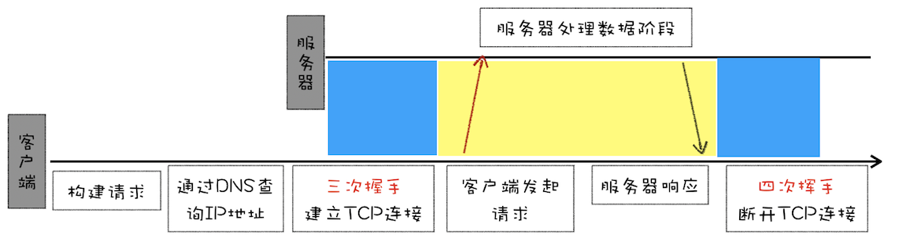
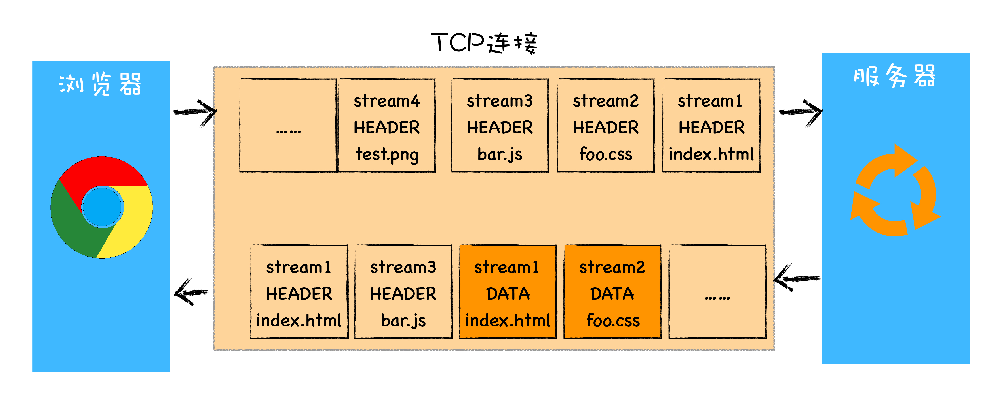

# HTTP 发展历程

## HTTP/0.9

基于请求响应的模式，只传递 HTML 超文本内容，所以叫做超文本传输协议。

- 基于 TCP 协议，根据 IP 和端口建立 TCP 连接，三次握手。
- 发送 GET 请求行信息，没有**请求头和请求体**。
- 读取对应的 HTML 文件，以 **ASCII** 字符流返回给客户端，没有返回头信息，只返回数据。
- HTML 文档传输完成后，断开连接。



## HTTP/1.0

核心诉求：**支持多种类型的文件下载**

- 引入请求头和响应头，以 Key-Value 形式保存。

  - HTTP 请求头说明期待返回什么类型的文件、以什么形式压缩、提供什么语言的文件、文件的编码方式。

    ```json
    accept: text/html // 期望文件类型
    accept-encoding: gzip, deflate, br  // 期望压缩方式
    accept-Charset: ISO-8859-1,utf-8  // 期望文件编码
    accept-language: zh-CN,zh // 期望文件语言
    ```

  - 服务器根据请求头准备数据，响应头会说明文件压缩方式、文件类型、文件编码。

    ```json
    content-encoding: br
    content-type: text/html; charset=UTF-8
    ```

- 引入状态码
- 引入缓存机制
  - 强缓存，`Expires`，一个绝对时间值，受限于本地时间。
  - 协商缓存，响应头`Last-Modified`对应请求头`Last-Modified-Since`，表示本地修改时间，如果浏览器在本地打开了文件，修改了 modified 时间，导致缓存时间不准。
- 引入持久连接。`Connection: Keep-Alive Keep-Alive:max-age=X`时开启，希望 TCP 不要立刻断开连接。

## HTTP/1.1

- 默认打开持久连接。
- 使用 CDN 实现域名分片机制，CDN 为每个域名同时维护 6 个 TCP 连接，减少资源下载时间。
- 支持虚拟主机。请求头增加了 Host 字段，因为一台屋里主机可以绑定多个虚拟主机，每个虚拟主机都有自己单独的域名，每个域名是公用的同一个 IP 地址。
- 引入 Chunk transfer 机制，支持动态生成的内容。服务器将数据分割成若干个数据块，每个数据块发送时会附上上个数据块的长度，最后使用一个零长度的块作为发送完成的标志。
- 引入客户端 Cookie
- 增加缓存管理和控制
  - 强缓存，`Cache-Control`，`no-store`不缓存到本地，`no-cache`缓存不提供给客户端。
  - 协商缓存，响应头`ETag`对应请求头`If-None-Match`，文件有变化就会变的哈希值。

## HTTP/2

### HTTP/1.1 的问题

**带宽利用率低**，原因有下：

1. TCP 慢启动，TCP 本身为了减少网络拥塞的策略
2. 同时开启多条 TCP 连接，造成竞争固定的带宽。带宽不足时，所有的 TCP 连接都会变慢
3. 队头阻塞的问题。一个 TCP 管道一个时刻只能处理一个请求，请求结束之前，其他请求处于阻塞状态。

### 多路复用

核心思想：**一个域名只使用一个 TCP 长连接，并且消除队头阻塞的问题**。

请求可以并行发送，每个请求有对应的 ID，服务器收到这些请求后，可以先返回已缓存的响应头，再返回响应体数据，因为每份数据都有对应的 ID，浏览器可以根据 ID 拼接出完整的 HTTP 响应数据。



#### 多路复用的实现

HTTP/2 的协议栈添加了一个**二进制分帧层**。

- 浏览器的请求数据经过二进制分帧层处理后，被转换为一个个（请求头、请求行、请求体分开）带有请求 ID 编号的帧
- 服务器接收到所有帧后，根据相同 ID 的帧合并成完整的请求信息
- 服务器的响应数据，响应行、响应头、响应体分别发送到二进制分帧层，二进制分帧层把这些数据转换为一个个带请求 ID 编号的帧，发送给浏览器
- 浏览器接收响应帧后，根据 ID 编号将帧的数据提交个对应的请求


HTTP/2 向下兼容，语义和 HTTP/1.1 相同，依然支持 Accept、Cookie、Cache 等，只是改变了传输方式。

### 其他特性

1. 可以设置请求的优先级，方便服务器优先处理优先级高的请求。
2. 支持服务器推送，服务器可以根据 HTML 页面的引用文件，直接把需要的文件发送给浏览器
3. 头部压缩

## HTTP/3

### TCP 的队头阻塞

HTTP/2 解决了 HTTP/1.1 应用层面的队头阻塞问题，但无法解决 TCP 本身的队头阻塞问题。TCP 在传输过程中，如果发生丢包，TCP 连接会暂停，等待丢失的数据包重新传输。这就造成了，**由于单个数据包丢失的队头阻塞**。

HTTP/2 是一个域名建立一个 TCP 管道，多个请求在这一个管道中传输，任何一个数据流出现丢包情况，就会阻塞连接中所有的请求。相同情况下，HTTP/1.1 由于为每个域名开了 6 个 TCP 连接，一个连接出现 TCP 队头阻塞时，其他连接还可以继续使用，传输效率反而比 HTTP/2 高。

### TCP 建立连接的延时

建立 TCP 连接时，三次握手需要消耗 1.5 个 RTT。建立 TLS 连接时，大约需要 1 ～ 2 个 RTT。那么，在传输数据之前，就需要消耗 3 ～ 4 个 RTT。

### HTTP/3 的 QUIC 协议

HTTP/3 绕过 TCP 协议，基于 UDP 协议为其增加了类似 TCP 的一些功能，这些功能叫做 QUIC 协议。


- 实现类似 TCP 的流量控制、可靠传输
- 继承 TLS 加密功能，使用 TLS1.3，减少握手的 RTT
- 实现 HTTP/2 的多路复用
- 实现快速握手，建立连接可以在 0-RTT 或 1-RTT 内完成

目前，服务器和浏览器端还没有实现完整支持，部署 HTTP/3 困难重重，系统内核对 UDP 的优化做得很少。
