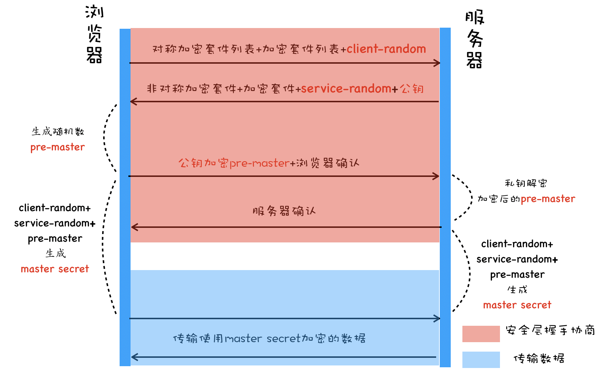

# HTTPS

## HTTP 的问题

HTTP 明文传输，在传输过程中每一步都可能被窃取或篡改，这就是中间人攻击。需要引入加密方案，在协议栈中插入安全层，让所有经过安全层的数据被加密或解密。

## 第一版：对称加密

**加密和解密时使用相同的密钥**。浏览器和服务器协商加解密方式，建立 HTTPS 安全连接。

- 浏览器发送给服务器，自身支持的加密方法列表和一个随机数 client-random
- 服务器选取加密方法，生成随机数 service-random，返回给浏览器
- 浏览器和服务器分别返回确认消息

> 问题：HTTPS 连接过程是明文发送，hacker 可以获取加密方法和随机数，合成密钥

## 第二版：非对称加密

A、B 两把密钥，一方用 A 密钥加密，对方只能使用 B 密钥解密，反之亦然。

服务器将一个密钥通过明文发送给浏览器，这就是公钥，自己留下的密钥是私钥。

> 问题：
>
> 1. 效率低，加解密慢，影响页面打开的速度。
> 2. 只能保证浏览器发送数据的安全，无法保证服务器方发送数据的安全。公钥明文传输，hacker 获取后，可以伪造数据发送给浏览器。

## 第三版：对称加密+非对称加密

增加一个随机数 pre-master，由浏览器接收到服务器发来的公钥后生成，利用非对称加密的公钥对 pre-master 加密，服务器用私钥解密 pre-master，返回确认连接的信息。这样 client-random、service-random、pre-master 三组随机数生成对称密钥。之后，双方可以按照对称加密的方式传输数据。

## 第四版：添加数字证书

hacker 可以伪造服务器分发公钥（中间人攻击），服务器需要证明自己。使用 CA 颁发的数字证书，可以证明自己的身份，同时数字证书里包含了服务器公钥。

上图，服务器没有直接返回公钥给浏览器，而是返回了数字证书，公钥包含在数字证书中。浏览器需要验证证书后，再继续后续流程。
