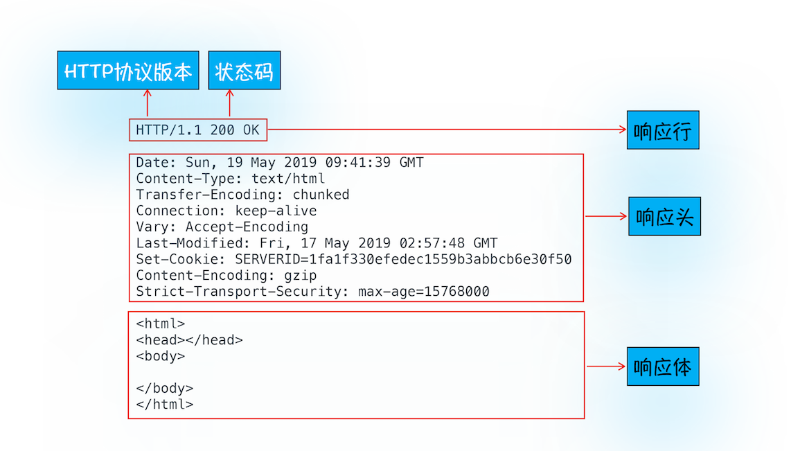

# HTTP 请求流程


## 浏览器发起 HTTP 请求

### 构建请求

```js
GET /index.html HTTP/1.1
```

### 查找缓存

发起网络请求前，会在浏览器缓存中查询是否有请求的文件。当缓存查找失败，会进入网络请求过程。

### 准备 IP 地址和端口

HTTP 是应用层协议，用来封装请求的文本信息，使用 TCP/IP 传输层协议发到网络上。在 HTTP 工作之前，需要通过 TCP 与服务器建立连接。


IP 地址有对应的域名，域名和 IP 的映射系统就是 DNS。浏览器有**DNS 数据缓存**，**浏览器会首先查询 DNS 缓存**，如果域名之前解析过，可以在缓存中获得 IP 地址。如果缓存中没有，**浏览器会请求 DNS**，返回域名对应的 IP。

IP 地址确定后，需要获得端口号，在 URL 没有特别指明时，HTTP 的默认端口是 80.

### 进入等待 TCP 队列

IP 和端口准备好之后，无法直接建立 TCP 连接，因为 Chrome 的规则是，同一个域名同时最多智能建立 6 个 TCP 连接。

### 建立 TCP 连接

排队等待结束后，浏览器通过 TCP 和服务器通过三次握手机制建立连接。浏览器和服务器总共发送三个数据包来确认连接的建立。

### 发送 HTTP 请求

TCP 连接建立后，浏览器和服务器可以进行通信，浏览器可以发送 HTTP 请求包。


## 服务器端处理 HTTP 请求

### 返回请求



### 断开连接

如果请求头或响应头有`Connection:Keep-Alive`，那么 TCP 连接会在发送后保持连接状态，下一次请求不会重新建立连接。否则，服务器会关闭当前建立的 TCP 连接。

### 重定向

当响应行的状态码是 301，说明当前地址资源永久被移除，需要重定向。此时，响应头的`Location:url`会返回重定向的地址，浏览器会根据`Location`的值，与重定向的服务器建立连接。

## 为什么第二次打开站点会快

浏览器提供 **DNS 缓存**和**页面资源缓存**。

资源缓存的处理过程如下：


浏览器根据响应头的`Cache-Control`字段设置是否缓存该资源，一般会设置一个缓存时长。`Cache-Control: max-age=2000`，这就表示缓存过期时间是 2000 秒。

当缓存过期，浏览器会向服务器发送请求，请求头带上`If-None-Match`字段（字段值取决于响应头的`Etag`字段），服务器收到请求头时，判断资源是否有更新。没有更新就会返回 304 状态码，浏览器可以继续使用缓存。

缓存细节见：[🔗MDN|HTTP 缓存](https://developer.mozilla.org/zh-CN/docs/Web/HTTP/Caching_FAQ)

## 如何保持登录状态

- 用户在登录页面输入信息后，POST 方法提交登录信息给服务器。
- 服务器验证登录信息后，生成一段字符串放在响应头的`Set-Cookie`字段里，发送给浏览器。
- 浏览器解析响应头，会把`Set-Cookie`字段的值保存在本地。
- 下次发送 HTTP 请求时，浏览器会把 Cookie 数据放进请求头`Cookie`字段。
- 服务器可以根据`Cookie`字段，判断是否登录。
