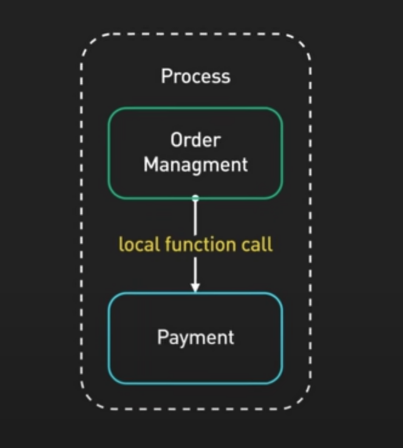
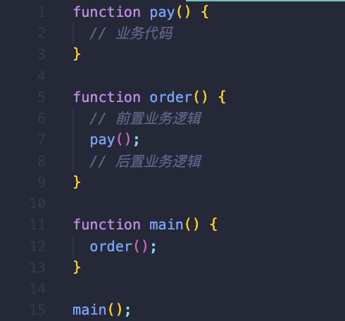
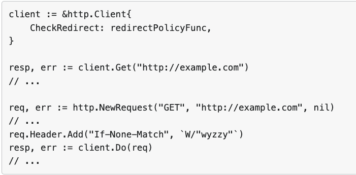
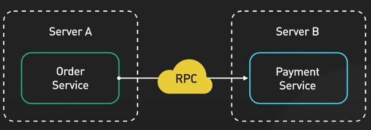
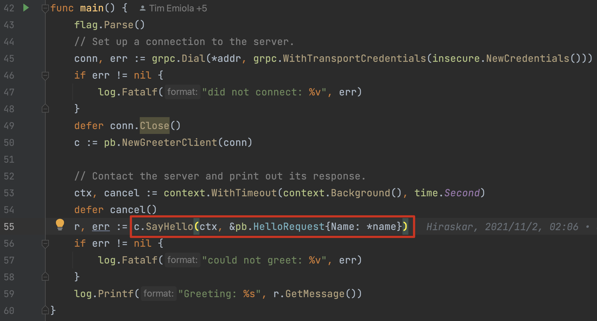
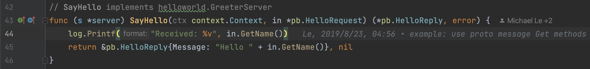
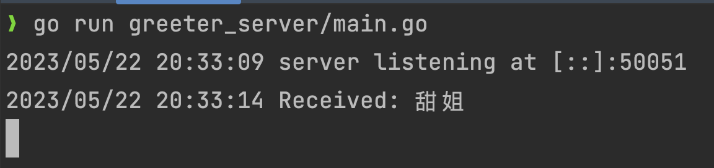
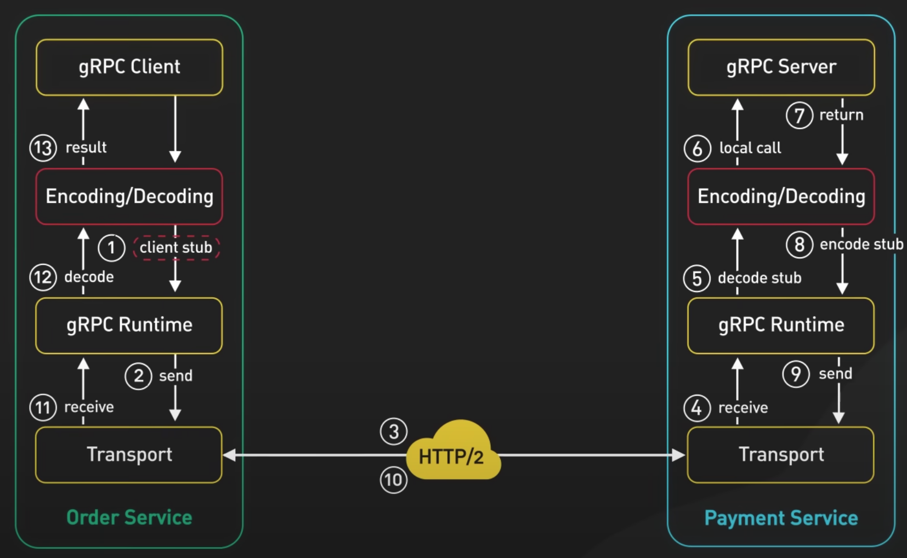

# 一次完整 RPC 是怎样的

> 💡 本期精彩看点：
> 
> - RPC 的简单介绍
> - 经典面试题：RPC 的通信流程是怎样的

# 什么是 RPC

> 像调用本地方法一样，调用远程服务
> 

全称 Remote Procedure Call，**远程过程调用**，与之相对的是**本地调用**。

## 本地调用

运行在同一个程序（进程）里，A 方法调用 B 方法，不涉及网络传输。

引用自 ByteByteGo

## 远程调用

### 常规 HTTP 调用

引用自 Go 官网 net/http example

### RPC

order 模块注册一个 payment 的 client，`client.pay()` 建立一个请求 RPC 连接，实现远程调用。在 order 的代码块里，**看上去就像是在调用本地方法**。

引用自 ByteByteGo

gRPC 的 helloworld 例子

目的：使开发者感受不到远程调用和本地调用的区别，感觉就像在调用同一个项目里的方法。

类比 HTTP，要解决的问题：

- **函数映射**
    - HTTP 不存在这个问题
- **网络传输**
    - HTTP 的框架库会用成熟的网络库基于 TCP/UDP 传输

# 一个完整的 RPC 总共分几步

> 桩文件 → 序列化 → TCP
> 
- 定义 IDL 文件，编译工具生成 stub 桩文件，相当于生成了静态库，实现函数映射
- 网络里传输的数据都是二进制数据，需要把请求参数、返回结果进行 encode 和 decode
- 根据 RPC 协议 约定数据头、元数据、消息体等，保证有 ID 能使请求和返回结果做到一一映射。
- 基于成熟的网络库进行 TCP / UDP 传输

引用自 ByteByteGo

## 面试题：描述 RPC 的通信流程

- 函数映射：静态代理，生成 stub 文件
    - 对比建立 HTTP 请求连接，RPC 在编写代码时，降低了复杂度
    - stub 文件让远程调用看上去像是**本地调用**
- 序列化：为了生成二进制数据
    - HTTP/1 直接发送 JSON，明文传输
    - gRPC 以 protobuf 作为序列化协议
- 网络传输
    - 自定义 RPC 协议实现通信，大厂几乎都用自定义 RPC 框架去自定义 RPC 协议。
    - 使用成熟的网络库，实现多路复用、可靠传输。

# 下节预告

- RPC 和 HTTP 有什么区别？
- 为什么要用 RPC，它带来了什么好处？
- RPC 会有哪些问题？
- 什么场景适合用 RPC？