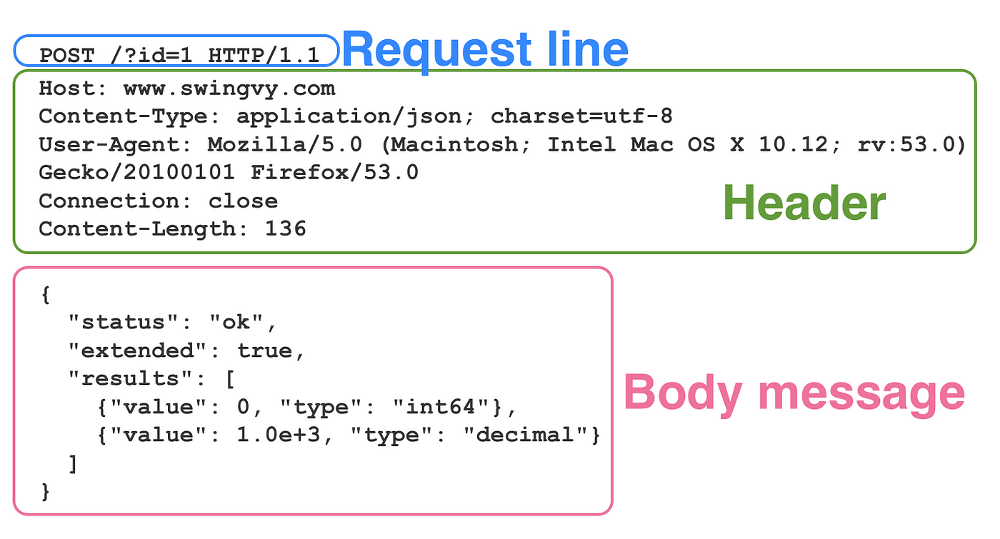
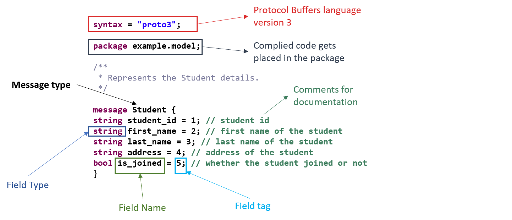
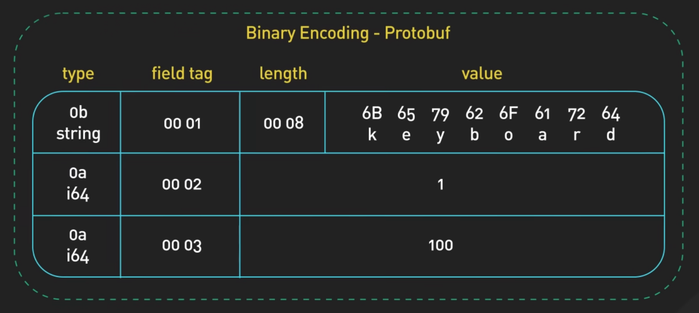
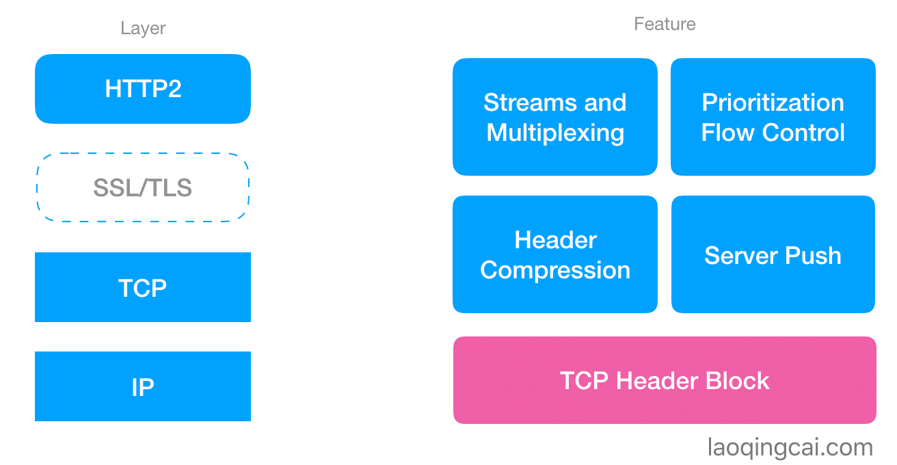

# RPC 和 HTTP 大比拼

> 💡 本期精彩内容：
> 
> - 面试高频：对比 RPC 和 HTTP 的区别
> - 浅析 RPC 的优势和不足
> - RPC 和 HTTP 的使用场景分别是什么

# 概念大有不同

- HTTP 是应用层协议。
- RPC 是远程过程调用，它是**调用方式**，对应的是本地调用。
- 所谓的 RPC 协议，实际上是基于 TCP、UDP、甚至 HTTP2 改造后的自定义协议。

# 对比：HTTP 和 RPC 的请求流程

引用自 ByteByteGo

## 编（解）码层

> 网络传输前，需要结构体转为二进制数据 → 序列化
> 
- HTTP/1.1
    - 序列化协议：JSON
        - 额外空间开销大，没有类型，开发时需要通过反射统一解决。

- RPC
    - 序列化协议：以 gRPC 为代表的 Protobuf，其他也类似
        - 序列化后的体积比 JSON 小 ⇒ **传输效率高**
        - 序列化、反序列化速度快，开发时不需要通过反射 ⇒ **性能消耗低**
        - IDL 描述语义比较清晰。

## 通信协议约定

> 基于 TCP 传输，都会有消息头和消息体，区别在于消息头
> 
- HTTP/1.1
    - 优点是灵活，可以自定义很多字段。
    - 缺点是包含许多为了适应浏览器的冗余字段，这些是内部服务用不到的。
- RPC
    - 可定制化，自定义必要字段即可。
    - 可摒弃很多 HTTP Header 中的字段，比如各种浏览器行为。

## 网络传输层

> 本质都是基于 Socket 通信
> 
- HTTP/1.1
    - 建立一个 TCP 长连接，设置 keep-alive 长时间复用这个连接。
    - 框架中会引入成熟的网络库，给 HTTP 加连接池，保证不只有一个 TCP 连接可用。
- RPC
    - 建立 TCP 连接池，框架也会引入成熟网络库来提高传输性能。
    - gRPC 基于 HTTP/2，拥有多路复用、优先级控制、头部压缩等优势。
        
        
        

# RPC 的优势和不足

## 优势

- 相较于 HTTP/1.1，数据包更小、序列化更快，所以传输效率很高。
- 基于 TCP 或 HTTP/2 的自定义 RPC 协议，网络传输性能比 HTTP/1.1 更快。
- 适用于微服务架构，微服务集群下，每个微服务职责单一，有利于多团队的分工协作。

## 不足

- RPC 协议本身无法解决微服务集群的问题，例如：服务发现、服务治理等，需要工具来保障服务的稳定性。
- 调用方对服务端的 RPC 接口有强依赖关系，需要有自动化工具、版本管理工具来保证代码级别的强依赖关系。例如，stub 桩文件需要频繁更新，否则接口调用方式可能出错。

# RPC 和 HTTP 的使用场景

- 微服务架构下，多个内部服务调用频繁，适合用 RPC。
- 对外服务、单体服务、为前端提供的服务，适合用 HTTP，特别是 HTTP/2 性能也很好。

# 下节预告

- 设计一个 RPC 框架，需要包含哪些模块
- 开源 RPC 框架，如何选型