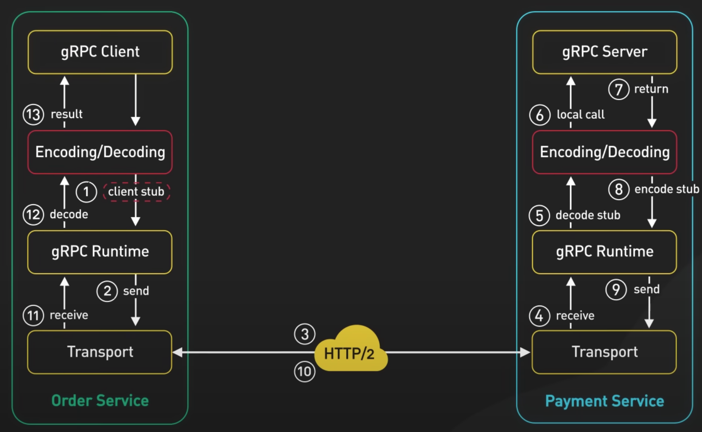
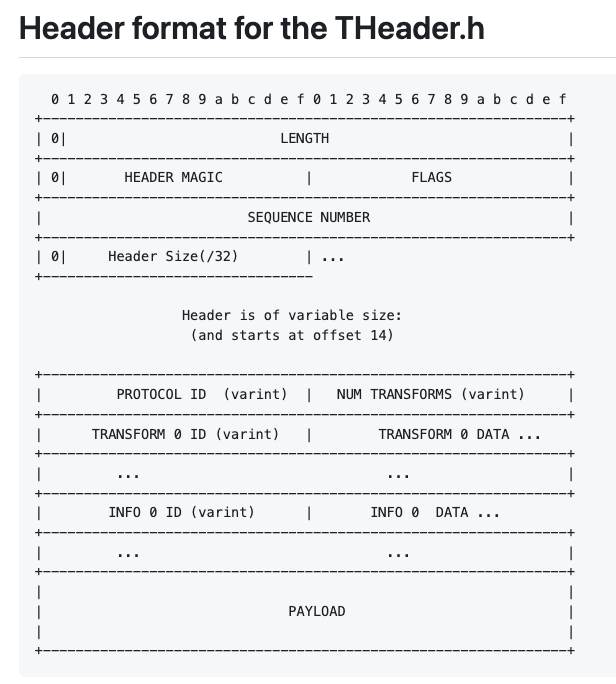
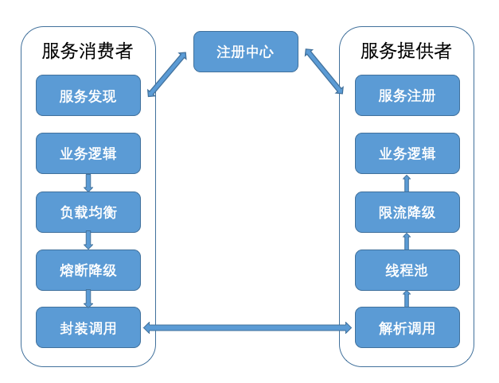
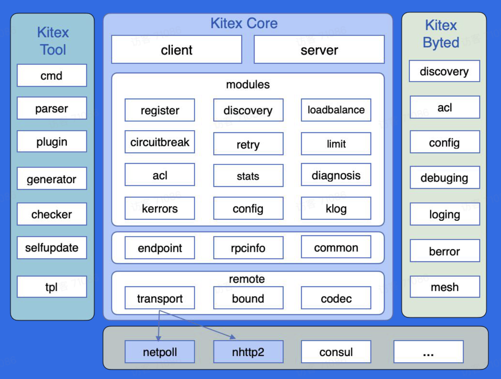

# RPC 框架对比

> 💡 本期精彩内容：
> 
> - RPC 框架需要承担哪些基础功能？
> - RPC 热门框架有哪些，有什么不同之处？

# RPC 框架职责

引用自 ByteByteGo

## 编解码层

### 目标

- 生成代码：代码生成工具将 IDL 文件转换成不同语言可以依赖的 lib 代码（类似于库函数）
- 序列化 & 反序列化：对象 ↔ 二进制字节流

### 选型

- 安全性
- 通用性：跨语言、跨平台
- 兼容性：序列化协议升级后，保证原服务的稳定性
- 性能
    - 时间：序列化反序列化的速度
    - 空间：序列化后的数据体积大小，体积越小，网络传输耗时越短

## 协议层

### 目标

- 支持**解析**多种协议，包含 HTTP、HTTP2、自定义 RPC 协议、私有协议等。

### RPC 通信协议的设计

> 大厂内部大部分用自定义的 RPC 协议，灵活 + 安全
> 
- 作用：TCP 通道中的二进制数据包，会被拆分、合并，需要应用层协议确定消息的边界（说人话：得知道哪几个二进制包是这一条请求）
- 协议构成
    
    
    
    - 协议头 - 固定部分：整体长度、协议头长度、消息类型、序列化方式、消息 ID 等
    - 协议头 - 扩展部分：不固定的扩展字段，各种协议 DIY 的字段
    - 协议体：业务数据

## 网络传输层

> 一般使用成熟的网络通信框架（例如：Netty），会和 RPC 框架解耦
> 

### 目标

- IO 多路复用实现高并发，可靠传输

### 选型指标

- 易用：封装原生 socket API
- 性能：零拷贝、建立连接池、减少 GC 等

# RPC 热门框架

## 跨语言调用型

- 典型代表：grpc，thrift
- 特点：
    - 提供最基础的 RPC 通信能力。
    - 专注于跨语言调用，适合不同语言提供服务的场景。
    - 没有服务治理等相关机制，需要借助其他开源工具去实现服务发现、负载均衡、熔断限流等功能。

## 服务治理型

- 典型代表：rpcx，kitex，dubbo
- 特点：
    - 提供最基础的 RPC 通信能力。
        - 服务定义（函数映射）
        - 多消息传输协议（序列化协议）
        - 多网络通信协议（TCP、UDP、HTTP/2、QUIC 等）
    - 提供服务治理能力：服务发现、负载均衡、熔断限流等。

## 框架功能简单介绍

### 分层设计

- 调用层：封装服务，提供RPC调用接口
- 服务治理层：服务发现、负载均衡、熔断限流等
- 通信层：多网络通信协议、多消息传输协议（编解码、序列化、压缩）

### 服务治理层

- 服务端
    - 服务注册：上报服务名和服务的 IP、端口
    - 健康检测：第一时间让调用方知道服务出现问题
    - 限流：过载保护，访问量过大，抛出限流异常
- 客户端
    - 服务发现：根据服务名发现服务的 IP、端口
    - 路由策略：实现流量隔离，应用于灰度发布、隔离联调环境
    - 负载均衡：把请求分发到服务集群的每个服务节点
    - 重试机制：捕获异常，根据负载均衡再次选择节点重发请求
    - 故障熔断：确定下游异常，请求直接被截断，快速执行失败

### 其他基础功能

- 日志 Log
- 监控 Metric
- 链路追踪 Tracing
- 丰富的插件机制

# 后续预告

> 概念 + 高频面试题 + 源码
> 

解析一个高可用的 RPC 服务治理型框架，每一期攻破一个专项。