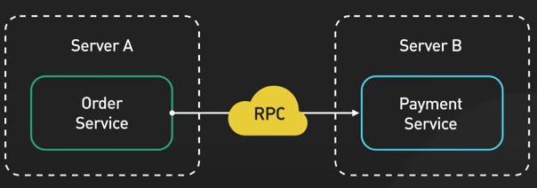
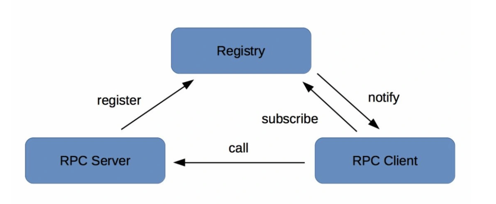
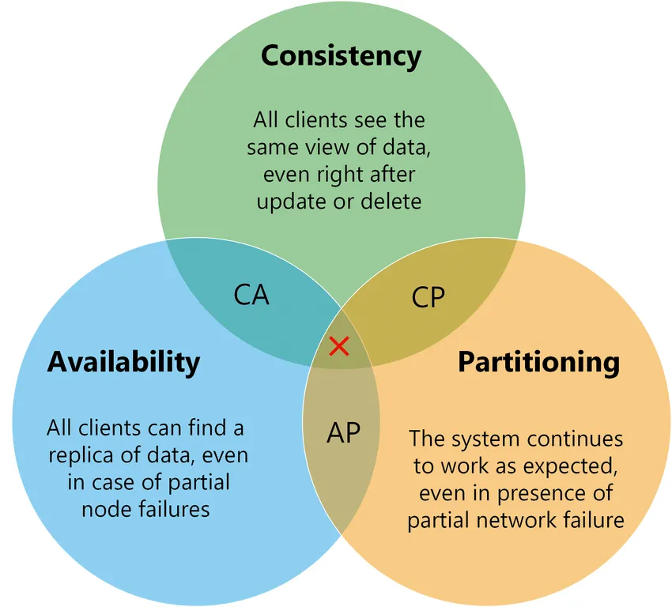

# 服务注册与服务发现

> 💡 本期精彩内容：
> 
> - 为什么需要服务注册与发现
> - 三角模型：调用方 - 注册中心 - 被调服务
> - 面试考点
> - 看 kitex 源码，如何实现服务注册

# 为什么需要服务注册与发现

> **定位**：服务名 → 服务地址（服务节点）
> 

引用自 ByteByteGo

- 在 RPC 框架下发起 RPC 调用时，就像调用本地方法一样，意味着，Client 代码里写的是 Server 的服务名和方法名
- 需要一个机制，让 Client 根据服务名，查询到 Server 的 IP 和端口
- DNS：域名 → IP
    - DNS 多级缓存机制，导致 Client 不能及时感知到 Server 节点的变化
    - DNS 不能注册端口，所以只能用来注册 HTTP 服务

# Client - Registry - Server

## 服务上线

- Server 启动后，向 Registry 注册自身信息
    - Registry 保存着所有服务的节点信息
    - Server 与 Registry 保持心跳，Registry 需要感知 Server 是否可用
- Client **第一次**发起 RPC 调用前，向 Registry 请求服务节点列表，并把这个列表缓存在本地
    - Client 与 Registry 保持数据同步，服务节点有变化时，Registry 通知 Client，Client 更新本地缓存
- Client 发起 RPC 请求，Server 返回响应

## 服务下线

- Server 通知 Registry 当前节点（A）即将下线
- Registry 通知 Client，Server 的 A 节点下线
- Client 收到通知后，更新本地缓存的节点列表，选择 Server 的其他节点发请求
- Server 等待一段时间后（防止网络延迟，有一些存量请求需要处理），暂停服务并下线

# 面试怎么考？

## 注册中心选型：CAP 理论

- 含义
    - C：一致性，所有节点同时看到的数据相同
    - A：可用性，任何时候都能被读写，至少有一个服务节点可用
    - P：分区容错性，部分节点出现网络故障时，整个系统对外还是能正常提供服务
- 在分布式系统中，由于节点之间的网络通信会存在故障，可能存在服务节点的宕机，所以 P 是必须项
- 在保证 P 的前提下， CA 难以同时满足，只能说在 CP 下尽量保证 A，在 AP 下尽量保证 C
- CP or AP
    - CP：牺牲一定的可用性，保证强一致性，典型代表有 ZooKeeper、etcd
    - AP：牺牲一定的一致性，保证高可用性，典型代表有 Eureka、Nacos
    - 选型：
        - 体量小，集群规模不大的时候，CP 可以满足需要
        - 体量大，有大批量服务节点需要同时上下线，选择 AP
            - 注册中心可能会负载过高：有大量的节点变更的请求、服务节点列表下发不及时
            - 强一致性，就需要同步大量节点之间的数据，服务可能长时间不可用

## 如何识别服务节点是否可用：心跳机制

> 目的：Client 实时感知 Server 节点变化，避免给不可用节点发请求
> 

### 正常流程

- Server 每隔几秒向 Registry 发送心跳包，收到响应则表示服务节点正常，在指定时间内没收到响应，则判定为失败
- 注册中心发现某个节点不可用时，会通知 Client，Client 更新本地缓存的服务节点列表

### 特殊情况

> 心跳断了不代表服务宕机，也许是网络抖动，不能判断出服务节点不可用
> 
- 发现心跳断了，Registry 立即通知 Client 某节点不可用，避免服务真的宕机时，仍然有请求发来
- Registry 继续向 Server 发心跳，如果发几次心跳都是失败的，才认为服务节点不可用。如果心跳恢复，再告知 Client 服务节点可用
    - 重试策略：先连续发几次心跳，过一定时间间隔后再发心跳，需要考虑重试次数和重试间隔

# 框架中的服务注册与发现

# 下期预告

负载均衡策略