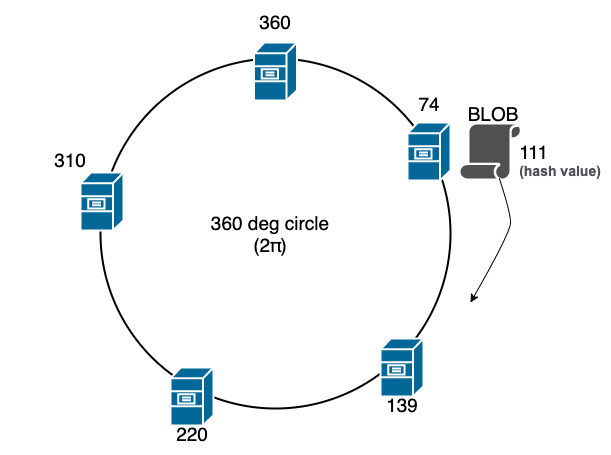

# 负载均衡

> 💡 本期精彩内容：
> 
> - 为什么需要负载均衡
> - 常见的负载均衡算法
> - 怎样看源码

# 负载均衡在解决什么问题

为了保证服务的可用性，一个应用会部署到多个节点上，这些节点构成服务集群，这也是分布式架构/微服务架构的显著特点之一。

如何把请求分发给集群下的每个节点，是负载均衡要解决的问题。这里的分发至少包含 2 个方面：

- 请求尽量均匀地打在各个节点上，每个节点都能接收请求
- 提高请求的性能，哪个节点响应最快，就优先调用哪个节点

# 有哪些负载均衡算法

## 随机、加权随机

- 通过随机算法，生成随机数，**节点足够多、访问量足够大**时，每个节点被访问的概率基本相同
- 适用场景：请求量大，各个节点的性能差异不大

## 轮询、加权轮询

- 按照固定顺序，挨个访问可用的服务节点
- 给节点赋权重，权重越大，被访问的概率越高
    - 如何调整节点的权重？成功+ 失败-
- 场景：存在新老机器，节点性能不同，发挥新节点的优势

## 哈希、一致性哈希

- 通过哈希函数把服务节点放到哈希环上
- 与**本地缓存**相结合，同一来源的请求计算出的哈希值相同，**同一来源的请求都映射到同一节点**，提高缓存的命中率
- 场景：不同客户端请求差异大，需要用到本地缓存

## 指标类

- 最少连接法
    - 用 Client - Server 间的连接数代表节点的负载
    - 场景：节点性能差异大，但不好提前做好权重定义
- 最少活跃数
    - 用活跃请求数（已经接收但没有返回的请求），代表负载
    - 缺陷：每个请求耗时不同，请求数不能代表实际负载
- 最快响应时间
    - 指标：平均耗时、TP99、TP999，选响应时间最短的

# 看源码

- 服务发现中，负载均衡处于哪一步？
- 各个负载均衡算法的核心代码，怎么看？