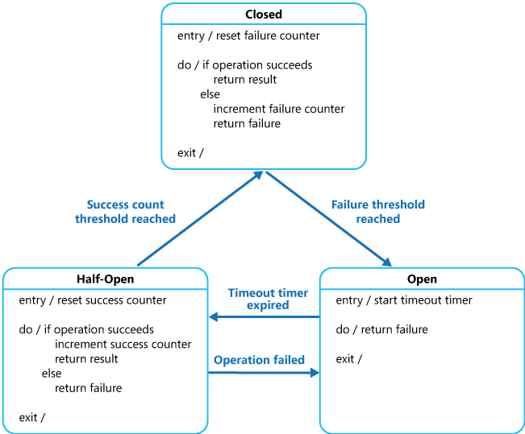
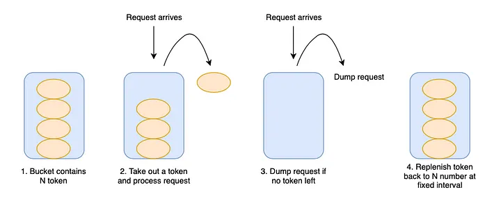
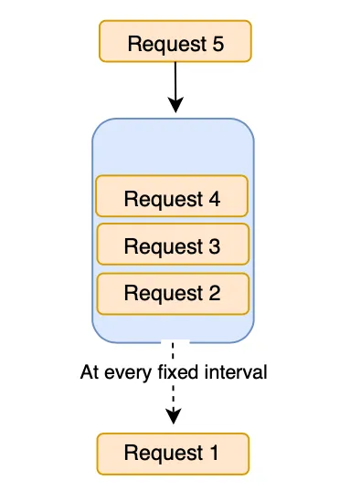
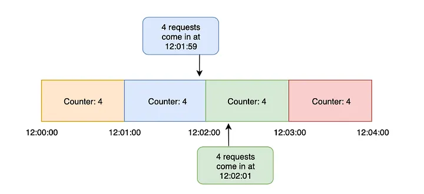
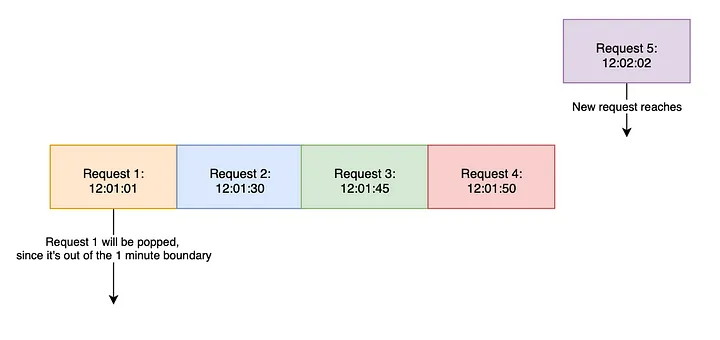

# 熔断 - 限流 - 降级

> 💡 本期精彩内容：
> 
> - 熔断、限流、降级，各自要解决什么问题
> - 限流常见算法有哪些
> - 熔断、限流、降级的核心思想是什么

# 熔断

## 场景

- 服务端出现问题
    - 服务指标：响应时间、错误率、连续错误数等，设置一个阈值，持续超过阈值触发熔断
    - 硬件指标：CPU、内存、网络IO

## 目的

- 服务端恢复需要时间，服务端需要歇一歇
- 避免全调用链路崩溃，不能把请求再发给 Server 了，一堆积带来其他服务也出问题

## 手段

- 熔断器直接抛出熔断的异常响应，三个状态切换，决定是否处于熔断状态

## 流程

1. Server 被监控到异常，触发熔断，熔断器抛出熔断的异常响应
2. Client 收到异常，利用负载均衡重新选择节点，后续请求不再打到被熔断的节点
3. 一段时间后，Client 再对这个节点重新请求，如果正常响应，则缓慢对这个节点放开流量，如果仍然是熔断，则继续执行 Step 2，如此循环

> 参考：
[https://learn.microsoft.com/en-us/previous-versions/msp-n-p/dn589784(v=pandp.10)](https://learn.microsoft.com/en-us/previous-versions/msp-n-p/dn589784(v=pandp.10))
[https://www.cloudwego.io/zh/docs/kitex/tutorials/service-governance/circuitbreaker/](https://www.cloudwego.io/zh/docs/kitex/tutorials/service-governance/circuitbreaker/)
> 

# 限流

## 场景 & 目标

- 突发的流量增大，使系统崩溃。
- 判断指标：节点当前连接数、QPS 等

## 手段

### 静态算法

- 令牌桶：系统以恒定速率产生令牌并把令牌放到桶里，每个请求从桶里拿到令牌才会被执行，反之被限流。

- 漏桶：令牌桶的特殊情况，令牌桶的桶容量为 0 就是漏桶。系统匀速产生令牌，没被取走也不会积攒下来。系统处理请求是均匀的。
    - 对比：令牌桶允许积攒令牌，可以解决偶发的流量突变。令牌桶的容量不能设置太大，否则达不到限流效果。

- 固定窗口：固定时间段内，只执行固定数量的请求。

- 滑动窗口：类似于固定窗口，只是滑动窗口会随着时间线挪动窗口。
    - 窗口时间以秒为单位更合适，用分钟为单位时，不能保证分钟内的请求是均匀分布的，还是会有系统崩溃的可能。

> 参考：
[https://betterprogramming.pub/4-rate-limit-algorithms-every-developer-should-know-7472cb482f48](https://betterprogramming.pub/4-rate-limit-algorithms-every-developer-should-know-7472cb482f48)
> 

### 动态算法：BBR

类似于 TCP 的拥塞控制，根据一系列指标来判定是否需要触发限流。

## 流程

- 在中间件记录流量和阈值，并在中间件中实现限流算法。
- 对于偶发性的触发限流，只要在超时范围内，可以同步阻塞等待请求被处理。
- Server 的某个节点触发了非偶发性限流，Client 利用负载均衡调低该节点的权重，尽量少向这个节点发请求。
    - 区别于熔断的不再发请求，限流仍然会发请求，只是降低频率。

## 延伸

- 如何确定阈值？
    - 阈值太低，导致资源被闲置；阈值太高，导致系统撑不住而崩溃。
    - 上线后看监控，根据业务峰值 QPS 来约定阈值。
    - 上线前做压测，找准限流的阈值。

# 降级

## 场景 & 目的

- 系统出现故障后的补救措施，或可预见的故障前的应对措施，来保证整体的可用性。

## 手段

- 考虑停用部分监控埋点、日志上报等观测类中间件。
- 根据业务场景判断，停用边缘服务，返回服务繁忙之类的响应。
- 对于有缓存的接口，降级时只查缓存，不查 DB，没命中缓存则返回错误的响应。

# 核心思想

- 如何判断节点的健康状态？是否需要熔断/限流/降级？
    - 通过监控看指标：QPS、连接数、节点负载等
- 熔断/限流/降级后，怎么恢复？
    - 熔断限流搭配负载均衡，等节点恢复正常后，再重新选择
    - 降级有时是手动恢复